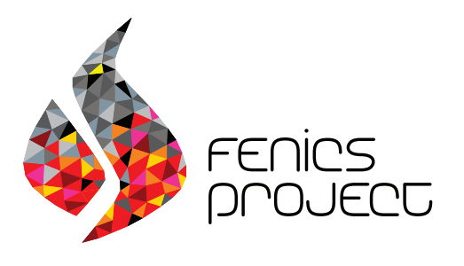

# :cyclone: FlowControl 
The FlowControl toolbox is an open-source toolbox addressing the simulation and control of 2D incompressible flows at low Reynolds number. It aims at providing a user-friendly way to simulate flows with actuators and sensors, a possibility to readily define new use-cases and support for operators & frequency responses computations.

This page contains introductory information about the toolbox. For more in-depth content, feel free to consult [the Wiki](https://github.com/williamjussiau/FlowControl/wiki).


<p align="center">

</p>

The toolbox is shipped with two benchmarks for flow control and allows for easy implementation of new cases.

<p align="center">

</p>

The core of the toolbox is in Python and relies on [FEniCS 2019.1.0](https://fenicsproject.org/) as a backend.

<p align="center">

</p>


## Installation 🛠️
### conda
The ```conda```  environment required to run the code can be extracted from the file ```environment.yml```. Additional path tweaking may be required for all FEniCS (```dolfin``` module) and custom modules to be found.

### Docker :whale:
[coming soon]


## What the toolbox offers
### Simulation
+ By default, the toolbox integrates in time the
**Incompressible Navier-Stokes equations**. For a 2D flow defined by its velocity ${v}({x}, t) = [v_1({x}, t), v_2({x}, t)]$ and pressure $p({x}, t)$ inside a domain ${x} = [x_1, x_2] \in\Omega$, the equations read as follows:

```math
\left\{
\begin{aligned} 
&  \frac{\partial {v}}{\partial t} + ({v} \cdot \nabla){v} = -\nabla p +  \frac{1}{Re}\nabla^2 {v}    \\
&  \nabla \cdot {v} = 0
\end{aligned}
\right.
```
+ The only numerical parameter of the non-dimensional equations, the Reynolds number defined as $Re = \frac{UL}{\nu}$, balances convective and viscous terms.

### Actuation and sensing
The toolbox allows the user to define actuators and sensors to respectively force and probe the flow. It also provides utility for controller design and implementation.

### Two benchmarks
Two classic [oscillator flows](https://journals.aps.org/prfluids/pdf/10.1103/PhysRevFluids.1.040501) used for flow control are shipped with the current code.
| Use-case | Description |
| ------   | ----------- |
| Cylinder | Flow past a cylinder at Re=100 |
| Cavity | Flow over an open cavity at Re=7500  |

### Examples of use of the toolbox
The following articles were based on previous versions of the code:
* [Jussiau, W., Leclercq, C., Demourant, F., & Apkarian, P. (2022). Learning linear feedback controllers for suppressing the vortex-shedding flow past a cylinder. _IEEE Control Systems Letters_, 6, 3212-3217.](https://hal.science/hal-03947469/document)
* [Jussiau, W., Leclercq, C., Demourant, F., & Apkarian, P. (2024). Data-driven stabilization of an oscillating flow with linear time-invariant controllers. _Journal of Fluid Mechanics_, 999, A86.](https://www.cambridge.org/core/services/aop-cambridge-core/content/view/47548BEA53D115E1F70FC1F772F641DB/S0022112024009042a.pdf/data-driven-stabilization-of-an-oscillating-flow-with-linear-time-invariant-controllers.pdf)
* [Jussiau, W., Demourant, F., Leclercq, C., & Apkarian, P. (2025). Control of a Class of High-Dimensional Nonlinear Oscillators: Application to Flow Stabilization. _IEEE Transactions on Control Systems Technology_.](https://ieeexplore.ieee.org/abstract/document/10884641/)


## Code philosophy
The philosophy of the toolbox for enabling the implementation of new use-cases easily, is the following:
1. Define a new use-case: inherit the ```FlowSolver``` abstract class
1. Attach ```Sensor```s and ```Actuator```s to an instance of a ```FlowSolver``` subclass
1. Run a simulation using an input signal $u(t)$ that can be open-loop or generated by a ```Controller``` for closed-loop

See [the toolbox Wiki](https://github.com/williamjussiau/FlowControl/wiki) for more information on how to perform these steps.


## Additional uses of the toolbox
The toolbox provides additional utility related to flow control:
* Compute dynamic operators A, B, C, D and mass matrix E,
* Restart a simulation from a saved file,
* Define an arbitrary number of actuators and sensors (e.g. feedback and performance sensors),
* Export time series (measurements from sensors, perturbation kinetic energy...) and fields for visualization,
* Modify the equations, the numerical schemes and the solvers used for the time simulation,
* Leverage parallel execution native to FEniCS,
* Use it as backend in an optimization tool (as in [Jussiau, W., Demourant, F., Leclercq, C., & Apkarian, P. (2025). Control of a Class of High-Dimensional Nonlinear Oscillators: Application to Flow Stabilization. IEEE Transactions on Control Systems Technology.](https://ieeexplore.ieee.org/abstract/document/10884641/)).


## Roadmap
The current roadmap is as follows:
* Complete the documentation :book:,
* Refactor and release additional control-related tools,
* Update the project to [FEniCSx](https://fenicsproject.org/documentation/),
* Sort and check all utility functions,
* Write general form for operator computation,
* Docker/venv/pip.


## Contact
:mailbox: william.jussiau@gmail.com


---


This README has been optimized for accessibility based on GitHub's blogpost "[Tips for Making your GitHub Profile Page Accessible](https://github.blog/2023-10-26-5-tips-for-making-your-github-profile-page-accessible)".

