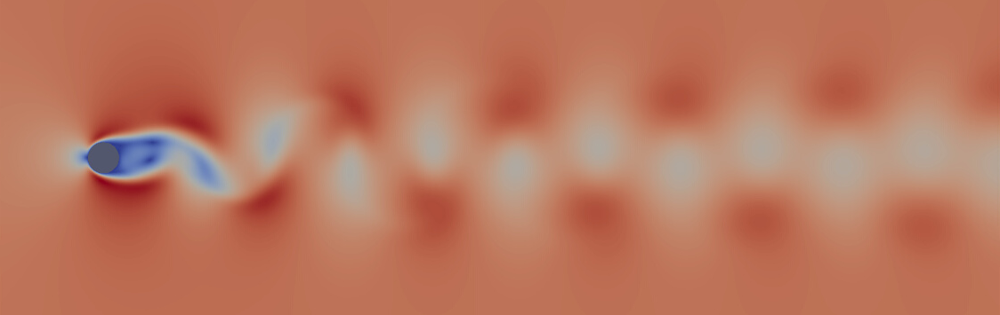
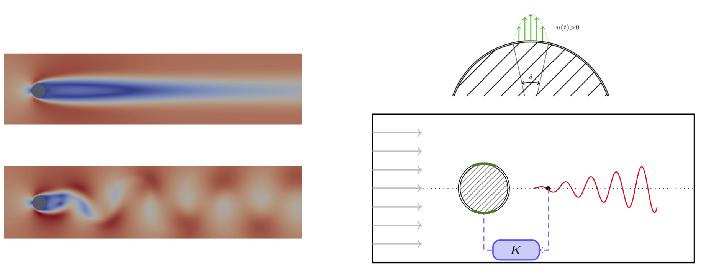

<!-- Ce que le projet fait
Pourquoi le projet est utile
Prise en main du projet par les utilisateurs
Où les utilisateurs peuvent obtenir de l’aide sur votre projet
Qui maintient et contribue au projet -->

# flowcontrol
The flowcontrol toolbox is an open-source toolbox addressing the simulation and control of 2D incompressible flows. It aims at providing a user-friendly way to simulate flows with actuators and sensors, and a possibility to readily define new use-cases.

## Introduction
The primary goal of the toolbox was feedback control design and implementation, but it may be used for a variety of other topics such as model reduction or identification, actuator and sensor placement... 

The toolbox implements two benchmarks for flow control and is designed to allow for easy implementation of new cases.

The core of the toolbox is in Python and relies on [FEniCS 2019.1.0](https://fenicsproject.org/) as a backend.


## What the toolbox offers

### Simulation
+ By default, the toolbox integrates in time the
**Incompressible Navier-Stokes equations**. For a 2D flow defined by its velocity ${v}({x}, t) = \begin{bmatrix} v_1({x}, t) \\\ v_2({x}, t) \end{bmatrix}$ and pressure $p({x}, t)$ inside a domain ${x} = \begin{bmatrix} x_1 \\\ x_2 \end{bmatrix}\in\Omega$, the equations read as follows:
```math
\left\{
\begin{aligned} 
&  \frac{\partial {v}}{\partial t} + ({v} \cdot \nabla){v} = -\nabla p +  \frac{1}{Re}\nabla^2 {v}    \\
&  \nabla \cdot {v} = 0
\end{aligned}
\right.
```
+ The only numerical parameter of the non-dimensional equations, the Reynolds number defined as $Re = \frac{UL}{\nu}$, balances convective and viscous terms.

+ For numerical integration in time, the Finite Element Method is used, using default continuous Galerkin elements of order 2 (for each component of the velocity) and 1 (for the scalar pressure).

+ To some extent, the toolbox aims at making the equations, numerical integration schemes and solvers replaceable by user-defined ones.

### Actuation and sensing
The toolbox allows the user to define actuators and sensors for forcing the flow. It also provides utility for controller design and implementation. See the examples given below.

### Two benchmarks
Two classic [oscillator flows](https://journals.aps.org/prfluids/pdf/10.1103/PhysRevFluids.1.040501) used for flow control are shipped with the current code.
| Use-case | Description | Feedback configuration |
| ------   | ----------- | ---------------------- |
| Cylinder | Flow past a cylinder at Re=100 |  SISO |
| Cavity | Flow over an open cavity at Re=7500  | SISO |

+ For the flow past a cylinder at Re=100, see e.g.:
  - [Barkley, D. (2006). Linear analysis of the cylinder wake mean flow. Europhysics Letters, 75(5), 750.](https://homepages.warwick.ac.uk/~masax/Research/Papers/Cylinder_EPL_75.pdf),
  - [Paris, R., Beneddine, S., & Dandois, J. (2021). Robust flow control and optimal sensor placement using deep reinforcement learning. Journal of Fluid Mechanics, 913, A25.](https://arxiv.org/pdf/2006.11005),
+ For he flow over an open cavity at Re=7500, see e.g.: 
  - [Barbagallo, A., Sipp, D., & Schmid, P. J. (2009). Closed-loop control of an open cavity flow using reduced-order models. Journal of Fluid Mechanics, 641, 1-50.](https://polytechnique.hal.science/hal-01021129/file/S0022112009991418a.pdf).


#### Flow past a cylinder at Re=100
##### Base flow


##### Periodic attractor (stable limit cycle)


##### Feedback configuration
The default feedback configuration (same as in [Jussiau, W., Leclercq, C., Demourant, F., & Apkarian, P. (2022). Learning linear feedback controllers for suppressing the vortex-shedding flow past a cylinder. IEEE Control Systems Letters, 6, 3212-3217.](https://hal.science/hal-03947469/document)) is as follows:
* Spanwise velocity measurement $y(t)=v_2({x_s}, t)$ at ${x_s} = \begin{bmatrix} 3 \\\ 0 \end{bmatrix}$,

* Boundary actuation at the poles of the cylinder, acting on the cross-stream velocity $v_2$. The velocity profile on the actuated boundary reads: 
$${v_{act}}({x}, t) =  -  \dfrac{(x_1-l)(x_1+l)}{l^2} u(t)$$
where $u(t)$ is the control input, $l = \frac{1}{2} D  \sin  \left( \frac{\delta}{2} \right)$, $\delta=10\degree$ are tunable actuator parameters.


<!-- ##### Summary
 -->


#### Flow over an open cavity at Re=7500
##### Base flow


##### Quasi-periodic attractor


Contrary to the cylinder, the attractor on the cavity at Re=7500 is quasi-periodic (featuring two incommensurable frequencies in its frequency spectrum):


##### Feedback configuration
The default feedback configuration (same as in [Leclercq et al. (2019). Linear iterative method for closed-loop control of quasiperiodic flows. Journal of Fluid Mechanics, 868, 26-65.](https://hal.science/hal-02296280/document)) is as follows:
*  Actuation is produced near the upstream edge of the cavity by a volume force $f({x}, t)=B({x}) u(t)$ in the momentum equation, acting on the cross-stream velocity, with:
$$B({x})=\left[ 0, \eta \exp\left( \frac{\left(x_1 - x_1^0\right)^2 + \left(x_2 - x_2^0\right)^2}{2\sigma_0^2}  \right), 0 \right]^T$$
By default, the center of the actuator is $(x_1^0, x_2^0) = (-0.1, 0.02)$, just before the cavity and slightly above the wall. The amplitude $\eta\approx 8.25$ is chosen such that $\int_\Omega B({x})^T B({x}) d\Omega = 1$. The spatial extent of the actuation is set by $\sigma_0 = 0.0849$, making the force reach $50\%$ of its peak value at a distance $0.1$ from its center.


*  The measurement is made through wall friction on the bottom wall just downstream of the cavity:
$$y(t) = \int_{x_1=1}^{1.1}   \left.  \frac{\partial v_1(t)}{\partial x_2} \right\rvert_{x_2=0} dx_1$$


## Code overview
The simulation revolves around the abstract class ```FlowSolver``` that implements core features such as loading mesh, defining function spaces, trial/test functions, variational formulations, numerical schemes and solvers, handling the time-stepping and exporting information. The class is abstract as it does not implement a simulation case _per se_, but only provides utility for doing so. It features four abstract methods, that are redefined for each use-case:

1. ```_make_boundaries``` provides a definition and naming of the boundaries of the mesh in a pandas DataFrame.
``` py
    @abstractmethod
    def _make_boundaries(self) -> pd.DataFrame:
        pass
```
2. ```_make_bcs``` provides a description of the boundary conditions on the boundaries defined above, in a dictionary.
``` py
    @abstractmethod
    def _make_bcs(self) -> dict[str, Any]:
        pass
```
3. ```_make_actuator``` provides an expression for the actuator.
``` py
    @abstractmethod
    def _make_actuator(self) -> dolfin.Expression:
        pass
```
4. ```make_measurement``` provides a way to probe the flow given the full field.
 ``` py
    @abstractmethod
    def make_measurement(self) -> np.ndarray:
        pass
```

For the two aforementioned examples, these methods are reimplemented in the classes ```CylinderFlowSolver``` and ```CavityFlowSolver``` that inherit from ```FlowSolver```.

Once a use-case has been defined by implementing the corresponding class, the basic feedback syntax has the following philosophy:
``` py
# Instantiate and initialize FlowSolver object
fs = CylinderFlowSolver(...)
fs.compute_steady_state(...)
fs.initialize_time_stepping(...)

# Instantiate Controller
Kss = Controller.from_file(...)

# Time loop
for _ in range(fs.params_time.num_steps):
    y_meas = flu.MpiUtils.mpi_broadcast(fs.y_meas)
    u_ctrl = Kss.step(y=-y_meas[0], dt=fs.params_time.dt)
    fs.step(u_ctrl=u_ctrl)
```

See examples for a more detailed description.


### Meshing tools
No meshing tools are shipped with this code, but ```gmsh``` (and its Python API) are good candidates for generating meshes for a particular use-case. The mesh should be exported to ```xdmf``` format, which can be reached thanks to the Python package [meshio](https://github.com/nschloe/meshio/tree/main).

### Visualization
All visualizations can be made with Paraview, whether it be for CSV timeseries or fields (saved as ```xdmf```).

### Additional used of the toolbox
The toolbox provides additional utility related to flow control:
* Compute dynamic operators A, B, C, D and mass matrix E,
* Restart a simulation from given field,
* Arbitrary number of sensors,
* Export fields for visualization,
* Parallel execution native to FEniCS,
* To some extent, easy modification of the equations, numerical schemes and solvers used for time simulation,
* Can be used as backend in an optimization tool (as in [Jussiau, W., Leclercq, C., Demourant, F., & Apkarian, P. (2022). Learning linear feedback controllers for suppressing the vortex-shedding flow past a cylinder. IEEE Control Systems Letters, 6, 3212-3217.](https://hal.science/hal-03947469/document)).


## Roadmap
The current roadmap is as follows:
* Complete the documentation,
* Handle MIMO configurations seamlessly,
* Refactor and release control and optimization tools,
* Update the project to [FEniCSx](https://fenicsproject.org/documentation/),
* Sort and check all utility functions,
* General form for operator computation.
* Docker embedding


## Examples of use of the toolbox
The previous versions of the tool were used in the following articles:
* [Jussiau, W., Leclercq, C., Demourant, F., & Apkarian, P. (2022). Learning linear feedback controllers for suppressing the vortex-shedding flow past a cylinder. IEEE Control Systems Letters, 6, 3212-3217.](https://hal.science/hal-03947469/document)
* [Jussiau, W., Leclercq, C., Demourant, F., & Apkarian, P. (2024). Data-driven stabilization of an oscillating flow with linear time-invariant controllers. Journal of Fluid Mechanics, 999, A86.](https://www.cambridge.org/core/services/aop-cambridge-core/content/view/47548BEA53D115E1F70FC1F772F641DB/S0022112024009042a.pdf/data-driven-stabilization-of-an-oscillating-flow-with-linear-time-invariant-controllers.pdf)

## Contact
william.jussiau@gmail.com

Also, I recommend [FEniCS documentation](https://olddocs.fenicsproject.org/dolfin/2019.1.0/) and [FEniCS forum](https://fenicsproject.discourse.group/) for problem solving regarding FEniCS itself.


---

This README has been optimized for accessibility based on GitHub's blogpost "[Tips for Making your GitHub Profile Page Accessible](https://github.blog/2023-10-26-5-tips-for-making-your-github-profile-page-accessible)".


<!-- ***
---
## Emphasis

**This is bold text**

__This is bold text__

*This is italic text*

_This is italic text_


## Lists

Unordered

+ Create a list by starting a line with `+`, `-`, or `*`
+ Sub-lists are made by indenting 2 spaces:
  - Marker character change forces new list start:
    * Ac tristique libero volutpat at
    * Facilisis in pretium nisl aliquet
    * Nulla volutpat aliquam velit
+ Very easy!

Ordered

1. Lorem ipsum dolor sit amet
2. Consectetur adipiscing elit
3. Integer molestie lorem at massa


1. You can use sequential numbers...
1. ...or keep all the numbers as `1.`

Start numbering with offset:

57. foo
1. bar


## Code

Inline `code`

Indented code

    // Some comments
    line 1 of code
    line 2 of code
    line 3 of code


Block code "fences"

```
Sample text here...
```

Syntax highlighting

``` py
def foo(bar: int=1)
  return bar + 1

print(foo(4))
```

## Tables

| Option | Description |
| ------ | ----------- |
| data   | path to data files to supply the data that will be passed into templates. |
| engine | engine to be used for processing templates. Handlebars is the default. |
| ext    | extension to be used for dest files. |

Right aligned columns

| Option | Description |
| ------:| -----------:|
| data   | path to data files to supply the data that will be passed into templates. |
| engine | engine to be used for processing templates. Handlebars is the default. |
| ext    | extension to be used for dest files. |


## Links

[link text](http://dev.nodeca.com)

[link with title](http://nodeca.github.io/pica/demo/ "title text!")

Autoconverted link https://github.com/nodeca/pica (enable linkify to see)


## Images


Like links, Images also have a footnote style syntax

![Alt text][id]

With a reference later in the document defining the URL location:

[id]: https://octodex.github.com/images/dojocat.jpg  "The Dojocat"


## Plugins

The killer feature of `markdown-it` is very effective support of
[syntax plugins](https://www.npmjs.org/browse/keyword/markdown-it-plugin).


### [Emojies](https://github.com/markdown-it/markdown-it-emoji)

> Classic markup: :wink: :cry: :laughing: :yum:
>
> Shortcuts (emoticons): :-) :-( 8-) ;)

see [how to change output](https://github.com/markdown-it/markdown-it-emoji#change-output) with twemoji.


### [Subscript](https://github.com/markdown-it/markdown-it-sub) / [Superscript](https://github.com/markdown-it/markdown-it-sup)

- 19^th^
- H~2~O


### [\<ins>](https://github.com/markdown-it/markdown-it-ins)

++Inserted text++


### [\<mark>](https://github.com/markdown-it/markdown-it-mark)

==Marked text==


### [Footnotes](https://github.com/markdown-it/markdown-it-footnote)

Footnote 1 link[^first].

Footnote 2 link[^second].

Inline footnote^[Text of inline footnote] definition.

Duplicated footnote reference[^second].

[^first]: Footnote **can have markup**

    and multiple paragraphs.

[^second]: Footnote text.


### [Definition lists](https://github.com/markdown-it/markdown-it-deflist)

Term 1

:   Definition 1
with lazy continuation.

Term 2 with *inline markup*

:   Definition 2

        { some code, part of Definition 2 }

    Third paragraph of definition 2.

_Compact style:_

Term 1
  ~ Definition 1

Term 2
  ~ Definition 2a
  ~ Definition 2b


### [Abbreviations](https://github.com/markdown-it/markdown-it-abbr)

This is HTML abbreviation example.

It converts "HTML", but keep intact partial entries like "xxxHTMLyyy" and so on.

*[HTML]: Hyper Text Markup Language

### [Custom containers](https://github.com/markdown-it/markdown-it-container)

::: warning
*here be dragons*
::: -->
