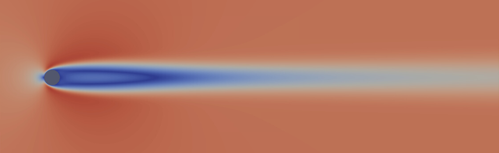
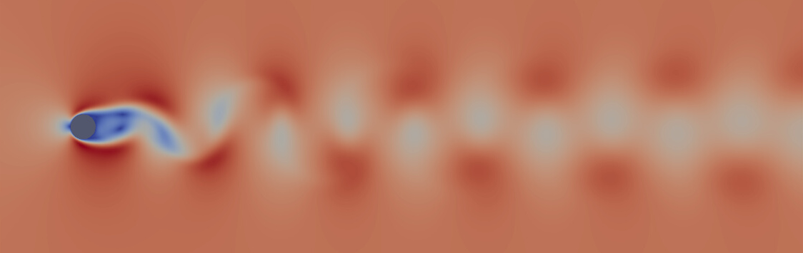
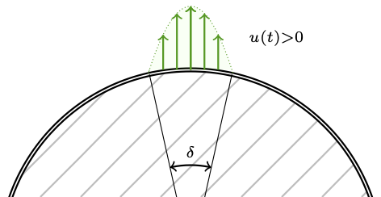
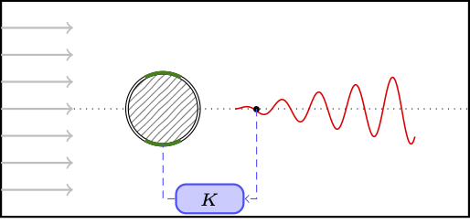
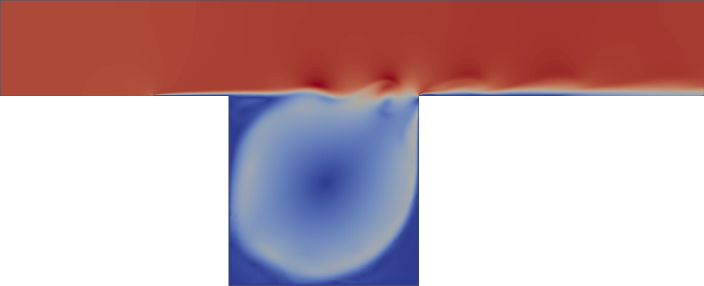
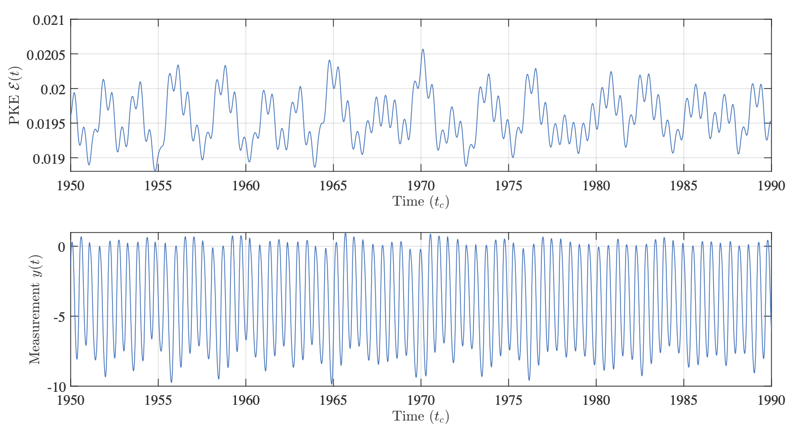
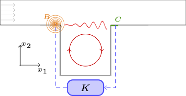

# Examples

## Flow Past a Cylinder at Re=100

### Illustration

Stationary solution

Periodic attractor (stable limit cycle)

### Description

The default feedback configuration (same as in [Jussiau, W., Leclercq, C., Demourant, F., & Apkarian, P. (2022). Learning linear feedback controllers for suppressing the vortex-shedding flow past a cylinder. *IEEE Control Systems Letters*, 6, 3212-3217.](https://hal.science/hal-03947469/document)) is as follows:

- Cross-stream velocity measurement $y(t)=v_2({x_s}, t)$ in the wake at ${x_s} = [3, 0]$
- Boundary actuation at the poles of the cylinder, acting on the cross-stream velocity $v_2$. The velocity profile on the actuated boundary reads:

  $${v_{act}}({x}, t) = -\dfrac{(x_1-l)(x_1+l)}{l^2} u(t)$$

  where $u(t)$ is the control input, $l = \frac{1}{2} D \sin \left( \frac{\delta}{2} \right)$, $\delta=10\degree$ are tunable actuator parameters.

### Related Articles

- [Jussiau, W., Leclercq, C., Demourant, F., & Apkarian, P. (2022). Learning linear feedback controllers for suppressing the vortex-shedding flow past a cylinder. *IEEE Control Systems Letters*, 6, 3212-3217.](https://hal.science/hal-03947469/document)
- [Jussiau, W., Leclercq, C., Demourant, F., & Apkarian, P. (2024). Data-driven stabilization of an oscillating flow with linear time-invariant controllers. *Journal of Fluid Mechanics*, 999, A86.](https://www.cambridge.org/core/services/aop-cambridge-core/content/view/47548BEA53D115E1F70FC1F772F641DB/S0022112024009042a.pdf/data-driven-stabilization-of-an-oscillating-flow-with-linear-time-invariant-controllers.pdf)

## Flow Over an Open Cavity at Re=7500

### Illustration

Stationary solution

Quasi-periodic attractor

Contrary to the cylinder, the attractor on the cavity at Re=7500 is quasi-periodic (featuring two incommensurable frequencies in its frequency spectrum):

### Description

The default feedback configuration (same as in [Leclercq et al. (2019). Linear iterative method for closed-loop control of quasiperiodic flows. *Journal of Fluid Mechanics*, 868, 26-65.](https://hal.science/hal-02296280/document)) is as follows:

- Actuation is produced near the upstream edge of the cavity by a volume force $f({x}, t)=B({x}) u(t)$ in the momentum equation, acting on the cross-stream velocity, with:

  $$B({x})=\left[ 0, \eta \exp\left( \frac{\left(x_1 - x_1^0\right)^2 + \left(x_2 - x_2^0\right)^2}{2\sigma_0^2}  \right), 0 \right]^T$$

  By default, the center of the actuator is $(x_1^0, x_2^0) = (-0.1, 0.02)$, just before the cavity and slightly above the wall. The amplitude $\eta\approx 8.25$ is chosen such that $\int_\Omega B({x})^T B({x}) d\Omega = 1$. The spatial extent of the actuation is set by $\sigma_0 = 0.0849$, making the force reach $50\%$ of its peak value at a distance $0.1$ from its center.

- The measurement is made through wall friction on the bottom wall just downstream of the cavity:

  $$y(t) = \int_{x_1=1}^{1.1} \left.  \frac{\partial v_1(x, t)}{\partial x_2} \right\rvert_{x_2=0} dx_1$$

### Related Article

- [Jussiau, W., Demourant, F., Leclercq, C., & Apkarian, P. (2025). Control of a Class of High-Dimensional Nonlinear Oscillators: Application to Flow Stabilization. *IEEE Transactions on Control Systems Technology*.](https://ieeexplore.ieee.org/abstract/document/10884641/)
