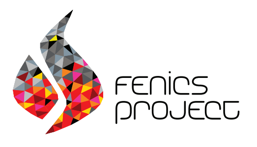

# FlowControl Documentation

FlowControl is an open-source toolbox for simulating and controlling 2D incompressible flows. It provides a user-friendly way to simulate flows with actuators and sensors, with support for operator and frequency response computations.

## Contents

- [Getting Started](getting-started.md) — Installation tips and quick start
- [Code Basics](code-basics.md) — Basic code description and usage
- [Code Advanced](code-advanced.md) — Additional code information and advanced usage
- [Code Utility](code-utility.md) — Utility functions surrounding the code
- [Numerical Details](numerical-details.md) — Details on the implementation
- [Third-party Tools](third-party-tools.md) — Tools for mesh generation and visualization
- [Examples](examples.md) — Showcase of benchmark flows
- [FAQ](FAQ.md) — Frequently asked questions and debug ideas

The toolbox is shipped with two benchmarks for flow control and allows for easy implementation of new cases.

The core of the toolbox is in Python and relies on [FEniCS 2019.1.0](https://fenicsproject.org/) as a backend.

## What the Toolbox Offers

### Simulation

By default, the toolbox integrates in time the **Incompressible Navier-Stokes equations**. For a 2D flow defined by its velocity ${v}({x}, t) = [v_1({x}, t), v_2({x}, t)]$ and pressure $p({x}, t)$ inside a domain ${x} = [x_1, x_2] \in\Omega$, the equations read as follows:

$$\left\{\begin{aligned} 
&  \frac{\partial {v}}{\partial t} + ({v} \cdot \nabla){v} = -\nabla p +  \frac{1}{Re}\nabla^2 {v}   \
&  \nabla \cdot {v} = 0
\end{aligned}\right.$$

The only numerical parameter of the non-dimensional equations, the Reynolds number defined as $Re = \frac{UL}{\nu}$, balances convective and viscous terms.

### Actuation and Sensing

The toolbox allows the user to define actuators for forcing and sensors to probe the flow. It also provides utility for controller design and implementation.

### Two Benchmarks

Two canonical [oscillator flows](https://journals.aps.org/prfluids/pdf/10.1103/PhysRevFluids.1.040501) often used for control are shipped with the current code:

| Use-case | Description |
| ------- | ----------- |
| Cylinder | Flow past a cylinder at Re=100 |
| Cavity | Flow over an open cavity at Re=7500 |

### Examples of Use of the Toolbox

The following articles were based on previous versions of the code:

- [Jussiau, W., Leclercq, C., Demourant, F., & Apkarian, P. (2022). Learning linear feedback controllers for suppressing the vortex-shedding flow past a cylinder. *IEEE Control Systems Letters*, 6, 3212-3217.](https://hal.science/hal-03947469/document)
- [Jussiau, W., Leclercq, C., Demourant, F., & Apkarian, P. (2024). Data-driven stabilization of an oscillating flow with linear time-invariant controllers. *Journal of Fluid Mechanics*, 999, A86.](https://www.cambridge.org/core/services/aop-cambridge-core/content/view/47548BEA53D115E1F70FC1F772F641DB/S0022112024009042a.pdf/data-driven-stabilization-of-an-oscillating-flow-with-linear-time-invariant-controllers.pdf)
- [Jussiau, W., Demourant, F., Leclercq, C., & Apkarian, P. (2025). Control of a Class of High-Dimensional Nonlinear Oscillators: Application to Flow Stabilization. *IEEE Transactions on Control Systems Technology*.](https://ieeexplore.ieee.org/abstract/document/10884641/)

## Roadmap

- Complete the documentation :book:
- Refactor and release additional control-related tools
- Update the project to [FEniCSx](https://fenicsproject.org/documentation/)
- Sort and check all utility functions
- Implement general form for operator computation
- Docker/venv/pip support

## Contact

:mailbox: william.jussiau@gmail.com
